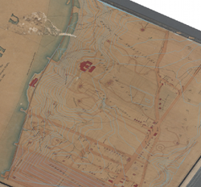
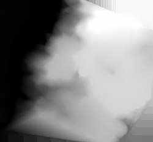
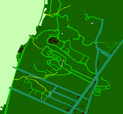
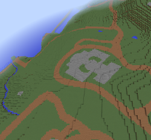

#Historical Maps in Minecraft

*a project by Paul Beaudoin and Leonard Richardson*

As fans of Minecraft, and fans of real-world maps, we took advantage
of [the New York Public Library's huge collection of digitized
maps](http://www.nypl.org/node/80186) to experiment with converting a
historical map to a Minecraft world.

We chose to convert [this 1860 map of the Fort Washington
area](http://digitalcollections.nypl.org/items/baa8b48a-d8d8-1066-e040-e00a180661dc)
into a Minecraft world. It's a topographical map, which means we can
convert it into a three-dimensional space. Most of its features are
features commonly seen in Minecraft--fields, water, dirt and stone
paths. Our experiment lets you virtually explore a nineteenth-century
Manhattan, a space that no longer exists.

We've generated two Minecraft versions of the Fort Washington
map. [The first
map](https://github.com/NYPL/historical-minecraft/tree/master/fort-washington/maps/fort-washington%20map%201)
is a simple creative-mode visualization of the historical map. [The
second
map](https://github.com/NYPL/historical-minecraft/tree/master/fort-washington/maps/fort-washington%20game%201)
turns historic Fort Washington into a Minecraft survival experience,
with valuable resources scattered beneath the ground.

Converting the map was a three-step process.

 1. Paul traced over the topographical lines on the historical map and
    generated a bitmap image showing the estimated elevation at every
    point on the map. This gave the maximum height (y-coordinate) for
    every (x,z) coordinate in the Minecraft world.

    

 2. Paul then traced over the map's major features and generated a
    second bitmap image that color-coded each pixel according to which
    Minecraft block (dirt, grass, cobblestone, etc.) should be exposed
    at that (x,z) coordinate in the Minecraft world.

    

 3. Leonard wrote a Python script that combines the two bitmap images
    into a three-dimensional Minecraft world.

    

##I. Generating the Elevation TIFF

The elevation tiff is a black & white bitmap representing the elevation at each pixel of the map as a value from pure black (0 elevation) to pure white (highest elevation)

###Requirements

QGIS 2.2.0 ( http://qgis.org )
 - Activate Contour plugin
 - Activate GRASS plugin if not already activated 

A map image to work from
 - We used a geo-rectified TIFF exported from [this map](http://maps.nypl.org/warper/maps/16089#Rectify_tab) but any high rez scan of a map with elevation data and features will suffice.

###Process:

Layer > Add Raster Layer > [select rectified tiff]
 - Repeat for each tiff to be analyzed

Layer > New > New Shapefile Layer
 - Type: Point
 - New Attribute: add 'elevation' type whole number
 - remove id

Contour (plugin)
 - Vector Layer: choose points layer just created
 - Data field: elevation
 - Number: at least 20 (maybe.. number of distinct elevations + 2)
 - Layer name: default is fine

Export and import contours as vector layer:
 - right click save (e.g. port-washington-contours.shp)
 - May report error like "Only 19 of 20 features written." Doesn't seem to matter much

Layer > Add Vector Layer > [add .shp layer just exported]

Edit Current Grass Region (to reduce rendering time)
 - clip to minimal lat longs

Open Grass Tools
 - Modules List: Select "v.in.ogr.qgis"
 - Select recently added contours layer
 - Run, View output, and close

Open Grass Tools
 - Modules List: Select "v.to.rast.attr"
 - Name of input vector map: (layer just generated)
 - Attribute field: elevation
 - Run, View output, and close

Open Grass Tools
 - Modules List: Select "r.surf.contour"
 - Name of existing raster map containing colors: (layer just generated)
 - Run (will take a while), View output, and close

Hide points and contours (and anything else above bw elevation image)
Project > Save as Image

You may want to create a cropped version of the result to remove un-analyzed/messy edges

##II. Generating the Features TIFF

The features tiff represents the roads, paths, stationary water
bodies, running water bodies, and buildings of the map.

###Requirements

Inkscape & imagemagick

###Process
In Inkscape, import the original rectified tiff and the elevation tiff as a reference, making sure one perfectly overlays the other. Import the cropped elevation tiff on top of that and make sure it perfectly matches up with the uncropped elevation tiff behind it. With the cropped elevation tiff selected, do File > Document Properties > Page > Custom Size > Resize page to drawing or selection. This will ensure that when you export from Inkscape, the result is exactly the same size and corresponds pixel-to-pixel with the elevation tiff.

Depending on what features will be identified, set up separate layers for roads, paths, stationary water, streams, and buildings. Proceed to trace the features using the line/bezier tool. "Path > Stroke to path" is your friend when tracing creeks and paths with mostly regular widths. Placing features of similar type on independent layers makes it easier to mass assign colors by type. 

Each distinct resource types will be colored differently. In our case we decided that I would indicate the resource type by manipulating the R value of the color:

 - 10 dirt
 - 20 grass
 - 30 cobble
 - 40 stone brick
 - 200 water
 - 210 flowing water

Since G and B were ignored by the map generation code, I was able to manipulate G and B to my liking to create visual distinction when editing. For example, paths were colored RGB(10,228,61,255), which appears lime green, whereas roads were colored RGB(30,143,95,255), which appears dark green.

If there are any transparent areas remaining, set the document background color to whatever tile should be your default (e.g. grass)

Save your SVG. Export to TIFF using imagemagick:

    convert +antialias -depth 8 features.svg features.tif

This should produce a TIFF without anti-aliasing. (The -depth 8 flag converts it from 16 bit, which PIL can't read.) Open the image and zoom to an edge to confirm there are no intermediate color values. See below for rationale and troubleshooting. (If PIL complains when opening the tiff, you may need to open in GIMP and re-save.)

####Anti-Aliasing Troubleshooting

At writing, Inkscape isn't able to suppress anti-aliasing when exporting to raster. Whereas anti-aliasing is almost always a benefit, it's frustrating if you're trying to maintain specific R values. With anti-aliasing, pixels of intermediate value are created at the edges of shapes. For example, at the intersection of dirt and grass, a pixel with R value 15 was common (corresponding to half of 10 + 20). Leonard's python code was modified to round to the nearest accepted value when processing these edge values. Additionally the R values were reassigned to prevent, for example, blocks of water appearing at the intersection of road and grass (i.e. presume rounding errors will occur and ensure they're acceptable accidents).

Several attempts to force SVGs to render without anti-aliasing failed:

1. Reduce color pallette to 6 in GIMP. 
  - This worked, but created a lot of incorrect pixels at intersections.
1. Add crispEdges directives to all shapes:
  - e.g. `sed -i '.orig' 's/style="[^"]*"/&\'$'\nshape-rendering="crispEdges"/g' $file > $file~`
  - This was promising, but you're at the mercy of the viewer, and none seemed to respect it.

Ultimately imagemagick with +antialias worked for me. I gather that the success of this method is tied to the SVG renderer built with imagemagick. This is what I have:

    convert -list format | grep SVG
     MSVG  SVG       rw+   ImageMagick's own SVG internal renderer
      SVG  SVG       rw+   Scalable Vector Graphics (XML 2.7.3)
     SVGZ  SVG       rw+   Compressed Scalable Vector Graphics (XML 2.7.3)

# III. Building the world

The [script for generating the
worlds](https://github.com/NYPL/historical-minecraft/blob/master/fort-washington/generate_map.py)
uses [PIL](http://www.pythonware.com/products/pil/) to load the TIFF
bitmaps into memory, and
[pymclevel](https://github.com/mcedit/pymclevel) to generate a
Minecraft worlds, one block at a time. It's run successfully on both
Mac OS X and Linux.

The script starts by calculating how large the world needs to be. It
scales down the elevation bitmap so that a height of 0 on the bitmap
corresponds to a height of 12 on the Minecraft map. (This avoids
problems with void fog.)

Then, the script generates the world and enough chunks to hold the
map. It creates a wall of glass around the map area. It then generates
a pillar of stone at every (x,z) coordinate covered by the map. The
height of each pillar is controlled by the elevation bitmap, and the
block at the top of each pillar is controlled by the feature bitmap.

The world is a "superflat"-type world whose terrain consists entirely
of air blocks. This ensures that venturing outside the glass-encosed
map area will not cause Minecraft to generate new terrain.

To avoid discolored grass, the biome of every (x,z) coordinate on the
map is set to Plains (for a survival-mode map) or to Ocean (for a
creative-mode map).

#Related Links
Various related projects and helpful docs.

##Related Projects

###TopoMC

An [impressive Python library](https://github.com/mathuin/TopoMC) for
generating Minecraft maps from USGS data. Our script uses code from
TopoMC to build trees.

###UK Minecraft Map 

The UK Ordnance Survey generated a [5G Minecraft map of the entire
topography of the
UK](http://www.ordnancesurvey.co.uk/innovate/developers/minecraft-map-britain.html). Unfortunately,
we couldn't find detailed information about their process.

##Minecraft Map Resources

###pymclevel

Our script requires this library: a [low-level Python
library](https://github.com/mcedit/pymclevel) for manipulating
Minecraft's [Anvil](http://minecraft.gamepedia.com/Anvil_file_format)
file format. There are [libraries for many other
languages](http://minecraft.gamepedia.com/Development_resources#Libraries)
available.

###USGS Elevation TIFFS
This tutorial was helpful for generating sample elevation tiffs representing contemporary USGS data. Note that the geo-tiffs downloaded may need to be opened in QGIS and exported as tiffs to normalize the levels (lest you just see a lot of black).

http://www.qgistutorials.com/en/docs/working_with_terrain.html

http://earthexplorer.usgs.gov/

###Minecraft Type Ids
Useful for choosing resource type ids

http://minecraft-ids.grahamedgecombe.com/

##TIFF Generation
###Contours From Points
This tutorial explains how to generate contour lines from point elevation samples

http://www.gistutor.com/quantum-gis/19/55-how-to-generate-contours-using-point-data-in-quantum-gis-qgis.html

###GRASS Tutorial
Steps 1 and 2 from this tutorial informed GRASS usage

http://linfiniti.com/2010/12/3d-visualisation-and-dem-creation-in-qgis-with-the-grass-plugin/
